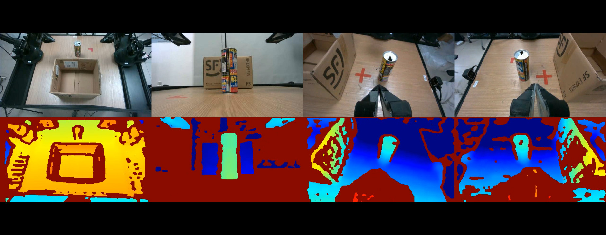
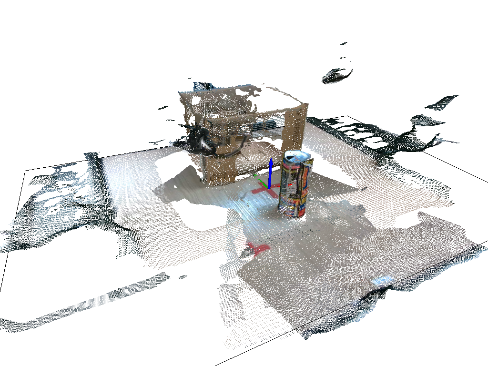

# ALOHA 3D

A modification of Interbotix ALOHA code to add support with 3D sensing capabilities.

Tianze Shi, School of Computer Science, PKU.

## Code Structure

- `aloha`: python code for ALOHA control based on [Interbotix ALOHA code](https://github.com/Interbotix/aloha) with depth sensing capability and automatic calibration support.

- `aloha_scripts`: a set of scripts to easily bringup and collect data using the ALOHA robot.

## ALOHA Data Collection



### Prerequisites

- Tested Environment:
  - Ubuntu 22.04
  - ROS Humble

- ALOHA hardware and software setup:
  - Follow the instructions in [Stationary ALOHA Getting Started](https://docs.trossenrobotics.com/aloha_docs/2.0/getting_started/stationary.html) to setup the stationary ALOHA robot.
  - In the "ALOHA Software Installation" step 1, instead of cloning the original `aloha` repo into the `~/interbotix_ws/src/` folder, copy the `aloha/` folder in this repo to the `~/interbotix_ws/src/` folder.

### Start ALOHA together with depth cameras

- ROS config 

  - YAML config file is located in `aloha/config/robot/aloha_stationary.yaml`.

  - You can change common parameters for all cameras such as resolution and auto exposure in `robot/cameras/common_parameters`.

  - You need to specify the camera names and serial number under `robot/cameras/camera_instances` accroding to your camera setup.

- bringup

  - After setting the correct camera parameters and serial numbers. run command in `scripts/bringup.sh` in order to start the robot.

  - You can check if bringup is successful by running `rqt` to inspect the realsense topics or check the console output.

### ALOHA calibration

- gripper calibration

  - ALOHA maps the gripper joint position to control signal range between 0~1. So we need to make sure the constants recording the max and min of gripper positions in `aloha/aloha/robot_utils.py` are correct so that the control signal is valid.

  - Run command in `scripts/calibrate_grippers.sh` and gripper positions will be displayed in terminal in real time. Manually adjust the gripper with your hand and record the corresponding values, then modify the `*_GRIPPER_JOINT_*` variables in `aloha/aloha/robot_utils.py`.

- camera calibration

  - Eye-in-hand and eye-to-hand camera extrinsics need to be estimated for the robot to achieve precise 3D perception. We can achieve this by camera calibration. The calibration requires photos of chessboard to be taken by the cameras with known end-effector positions.

  - You can pre-define a set of ALOHA arm joint potisions in `aloha/config/calibration_positions_*.txt`, each line represents a set of joint positions for both arms. Since one chessboard position cannot calibrate all the cameras (when chessboard lays down, the bottom camera cannot see it.), you can define multiple chessboard positions and take pictures respectively.

  - Run command in `scripts/calibrate_cameras.sh`, both arms will reach the pre-defined positions one by one, then take pictures of the chessboard and save them, together with the corresponding joint positions.

  - Exmaple calibration data are in `data/calibration_info_*`.

### Teleoperation, Record and Replay...

These functionalities are the same as the original repo. You can check the `scripts/` folder and [ALOHA Operation Guide](https://docs.trossenrobotics.com/aloha_docs/2.0/operation.html) on how to run them. 

## ALOHA 3D Sensing



After collecting the calibration data and teleoperation data, we can utilize the data (which contains depth information) to achieve 3D sensing capabilities. Such as calculate camera extrinsics in world coordinate or reconstruct a pointcloud.

### Prerequisites

- Tested Environment:
  - Ubuntu 22.04
  - python 3.10

### Calculate camera extrinsics

- Camera caliration code is in folder `cam_calibration`.

- Before running the script, prepare collected data into `cam_calibration/data/` folder, together with `base2ee` transformation matrices (for example `cam_calibration/data/aloha2_lay/left_arm/base2ee` shows transformation matrices from left arm base to end effector, this can be obtained by forward kinematics).

- Usage
```
cd cam_calibration
python calib.py --chessboard_position [position]
```

- After running the `calib.py` script, the following will be calculated and saved

  - detected chessboard corners visualization
  - world2cam transformation matrix
  - estimated intrinsic matrix (you can use the estimated one, or the one from realsense firmware)
  - reprojection error visualization

### Reconstruct pointcloud

- Pointcloud reconstruction code is in folder `pcd_reconstruction`.

- Usage

  - First, you can easily use script `cam_calibration/summary.py` to create a summary of all the transformation matrices that will be used during pointcloud reconstruction. Results will be saved in `cam_calibration/res` folder:
    - gripper to eye-in-hand camera transformation
    - world to arm base transformation
    - world to eye-to-hand camera transformation

  - Second, you need to also prepare a hdf5 data recorded by ALOHA (see [ALOHA Operation Guide](https://docs.trossenrobotics.com/aloha_docs/2.0/operation.html) on how to record data), which contains a video sequence and joint positions w.r.t each frame.

  - Finally, set the `dataset_dir`, `dataset_name` and `transformations_dir` variables to you prepared data paths. Then run the script `python create_pc.py` under the `pcd_reconstruction` folder. Reconstructed pointclouds will be saved under the `pointclouds` folder.

  - You can easily visualize the pointclouds of each frame using `visualize_pc.py`. (Example pointclouds `.ply` files and some screenshots can be viewed in `pointclouds` and `screenshots` folders)


